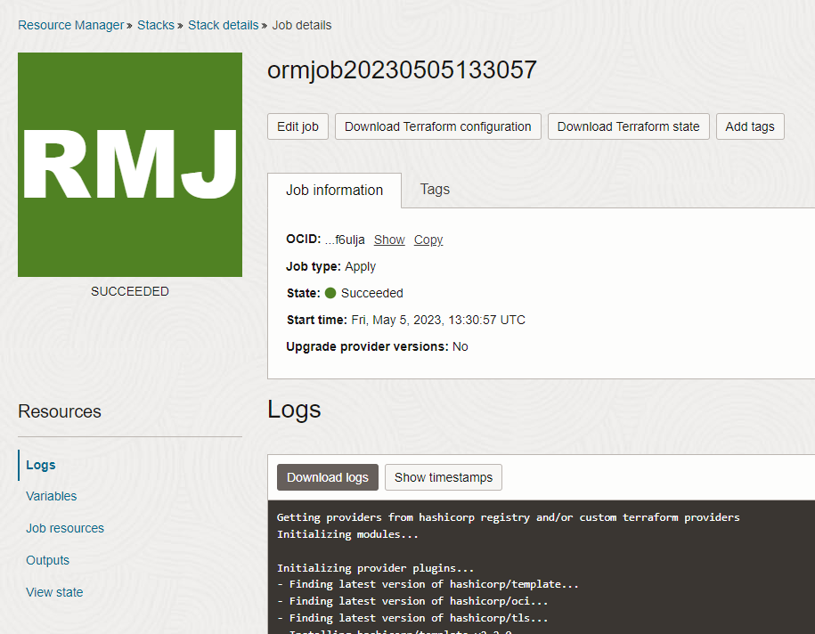

# oci-wordpress-mds

## Introduction

## Lab preparation
Deploy Wordpress on Oracle Cloud Intrastructure (OCI) and MySQL Database Service (MDS) using Terraform modules.

1. Use button below to start the stack

2. The script connect you to OCI login page.
Insert your tenancy name and click next

3. Expand **"Oracle Cloud Infrastructure Direct Sign-In"** and insert your username and password

4. The welcome stack page ask you to insert the first stack information
    1. check **"I have reviewed and accept the Oracle Terms of Use"**
    2. optionally, assign a name to your stack and insert a description
    3. Choose the compartment where to create the lab resources
    4. click next
    

5. Then you need to fill the mandatory variables. You can customize your installation as you prefer, but for the matter of this workshop we focus only on the minimla requirement
    - **MDS admin user's password**: Insert your MySQL Database password (for this lab we suggest you to use **Welcome1!** )
    - **MySQL WordPress user's password**: Insert your Wordpress password (please write down this password in a safe place)
    - **Wordpress administrator's username**: Insert **admin** (in case you choose a different name, please write down in a safe place)
    - **Email address of the Wordpress administrator**: Insert your email
    - Keep all other values as provided by the script
    

6. Verify that the checkbox **"Run apply"** is selected and press **Create**
    

7. The job start and after few seconds you can see the logs.
    the script requires about 15/20 minutes to complete.

8. When the job move "IN PROGRESS" (orange) state to "SUCCEEDED" state (green) you can go to next lab 

    

9. **[Next lab](./wordpress_test_installation.md)**
