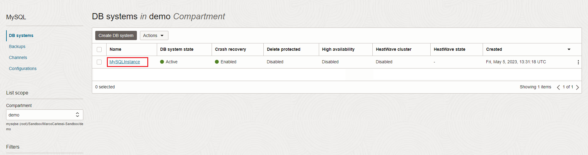

# oci-wordpress-mds

## Introduction

## Check your MySQL HeatWave Database instance

<h3> Task 1 - Explore MySQL HeatWave Database instance details </h3>

1. Return to OCI Dashboard

2. Navigate to MySQL HeatWave database instances

    

3. On the left menu you can navigate through the various settings
    - **DB systems** contains the list of your MySQL HeatWave Database instances
    - **Backups** contains the backups of all the MySQL HeatWave Database instances
    - **Channels** contains the replica configurations
    - **Configurations** contains the configurations (aka my.cnf) of your MySQL HeatWave Database instances

4. Click now on your instance name "MySQLInstance" to see the details.

    

5. In the Endpoints section there are the connection details. Please write down the private IP address (we use it later on)

    

5. As an alternative, you can also scroll down the page, and in the left menu choose "Endpoints" (scroll down the page).   
    You can see here the IP address of your instance and (optionally) the fqdn. We use this menu later to retrieve read replicas connection info. 

    

