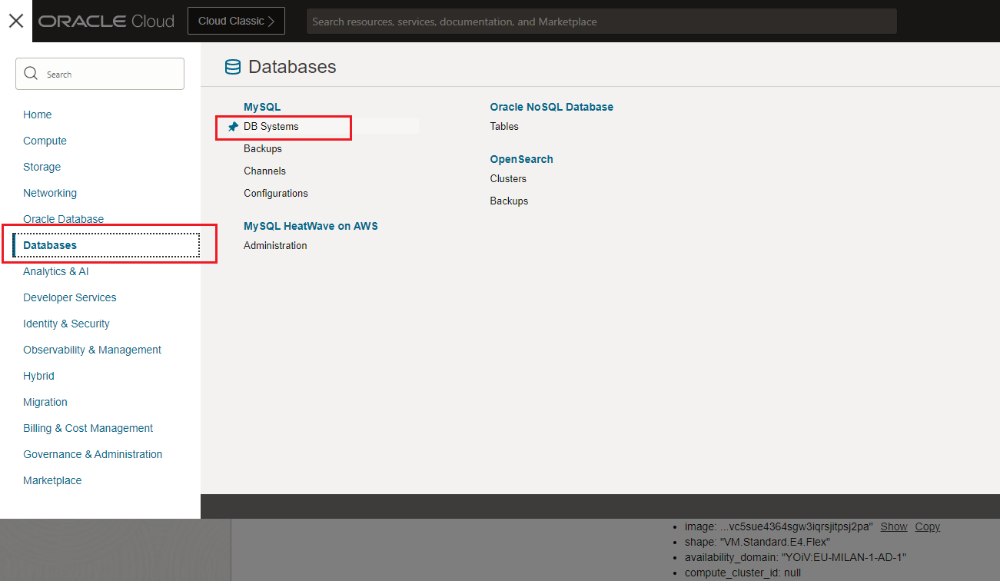
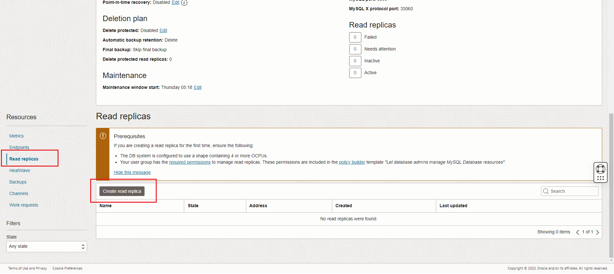
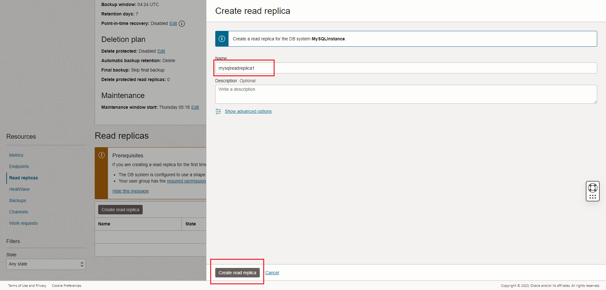
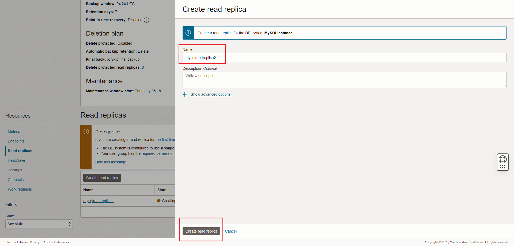
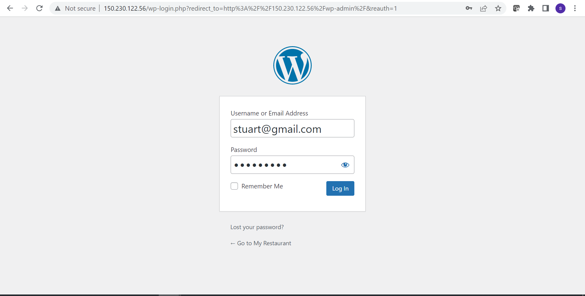
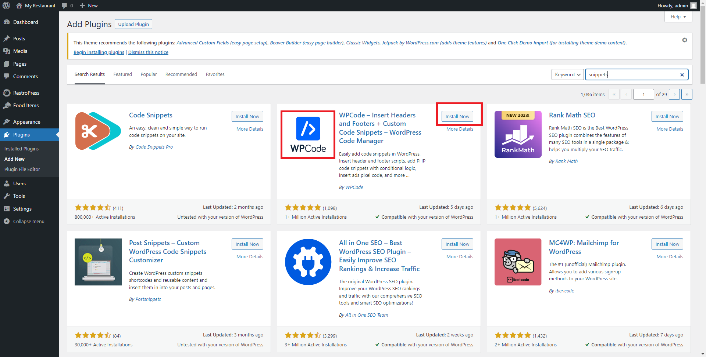
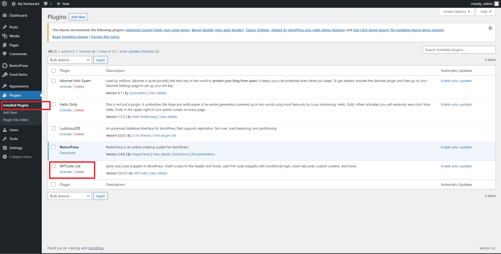
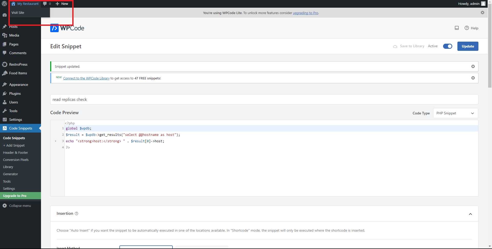
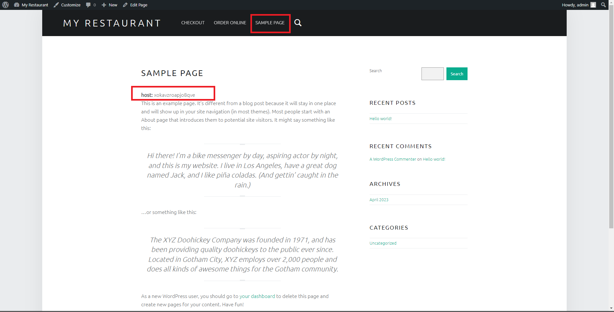

# oci-wordpress-mds

## Introduction

## Scale your service with Read Replicas
<details>
<summary><h3>Task 1 - Create Read Replicas</h3></summary>

1. Connect to OCI Dashboard

2. Navigate to MySQL HeatWave database instances page

    

3. Click now on your instance name "MySQLInstance" to see the details.

    

3. Scroll down the page to see the left side menu, then select "Read Replicas" and press button "Create read replica"

    

4. Change the "Name" to "mysqlreadreplica1" and press "Create read replica"

    

5. Click another time "Create replica" to create a second replica. Now use the name "mysqlreadreplica2" and confirm

    

6. Replica creation requires some time, so continue with next task

    

</details>


<details>
<summary><h3>Task 2 - Install and configure ludicrousdb wordpress plugin</h3></summary>

1. Connect with ssh to your wordpress server, as you did in lab 1

2. Execute these commands to install ludicrousdb

    ``` shell
    cd /var/www/html/wp-content/plugins
    sudo wget https://github.com/stuttter/ludicrousdb/archive/refs/heads/master.zip
    sudo unzip master.zip
    sudo mv ludicrousdb-master ludicrousdb
    sudo rm master.zip
    sudo chown -R apache. ludicrousdb
    sudo cp ludicrousdb/ludicrousdb/drop-ins/db.php ../db.php
    sudo cp ludicrousdb/ludicrousdb/drop-ins/db-config.php ../../

    ```

4. Retrieve MySQL load balancer Endpoint for read replicas.  
    Return to OCI Dashboard and go to MySQL HeatWave database instances

    

5. Click now on your instance name "MySQLInstance" to see the details.

    
    
6. Scroll down the page, and in the left menu choose "Endpoints".   
    You can see here the IP address of your instance for read write access **DB system primary** and for the read replicas load balancer **Read replica load balancer**. Write down thewe two IP, needed for the next step

    

7. We just need now to configure LudicrousDB to use the Read Replica Load Balancer. With and editor (like vim or nano) edit the db-config.php configuration file

    ``` shell
    cd /var/www/html/
    sudo vim db-config.php 

    ```

8. Scroll down the file to the database configuration section **$wpdb->add_database( array(** like in the example below

    

9. Edit the lines like in the below example, using your IP addresses retrieved in previous steps  

    

10. Save your canghes and aeturn to My Restaurant web page and check that the web site is still working and there are no issues with the new plugin

</details>

<details>
<summary><h3>Task 3 - Create a snippet</h3></summary>

1. Login to Wordpress as admin using the wp-admin page and entering the requested credentials (specified during the job creation in lab preparation lab) 

    http://***public-ip-address***/wp-admin

    

2. In the wordpress management page choose "Plugins" in the left side menu, then click the button "Add New"

    

3. In the left side textbox "Keyword" write "snippets" as in teh picture below

    

4. Choose "WPCode" plugin and press "Install now"

    

5. From left side menu choose Installed plugins, then press "Activate"under "WPCode Lite"

    

6. A new menu option is now visible in the left side menu.  
    Click on "Code snippets"

    

7. Choose "+ Add snippet" and select "Add Your Custom Code (New Snippet)". When teh mouse is over the option, a new button is displayed "USe snippet". Click it

    

8. Now insert snippet settings
    1. Add a title to our snippet: "read replicas check"
    2. Select "Code Type": PHP
    3. insert this code in "Code Preview"
        ``` php
        <?php
        global $wpdb;
        $result = $wpdb->get_results("select @@hostname as host");
        echo "<strong>host:</strong> " . $result[0]->host;
        ?>
        ```
    4. Scroll down to "insertion" and click "Run Everywhere" in "Location" to expand the section
    5. Select "Page-Specific"
    6. Click on "INsert Before Paragraph"

    

9. Keep the default insert before paragraph 1 and in the top of the page 
    1. Click Inactive switch to activate
    2. Click "Update" to save your changes

    

</details>

<details>
<summary><h3>Task 4 - Test read replicas</h3></summary>

1. We can now test our read replicas.  
    Click My Restaurant to return to our web site content

    

2. Select "Sample page".  
    You will see a new line under the titkle and before the text "host: *XXX*".  
    Refresh the page multiple times to see that the host changes periodically

    

3. This end our workshop.  
    Please remember that tenancy costs are calcualted on running instances and space used.
    Shutdown the instances when you don't need them or use the stack to easily destroy what we did in this workshop. 

</details>

