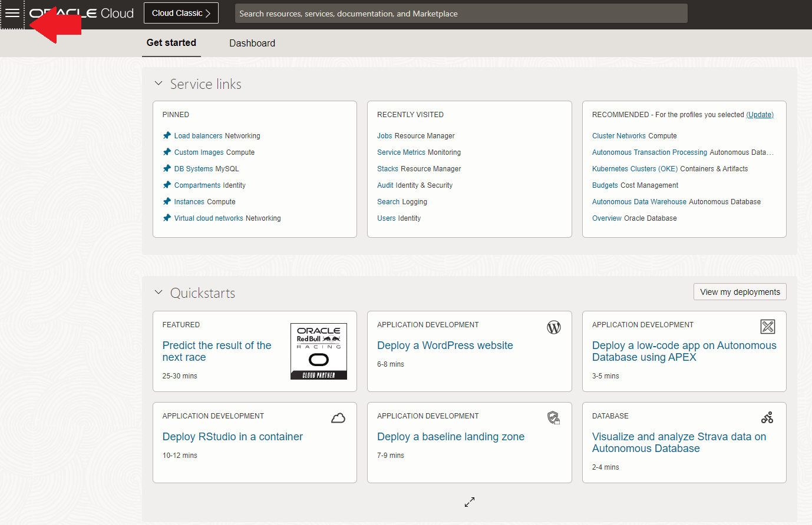
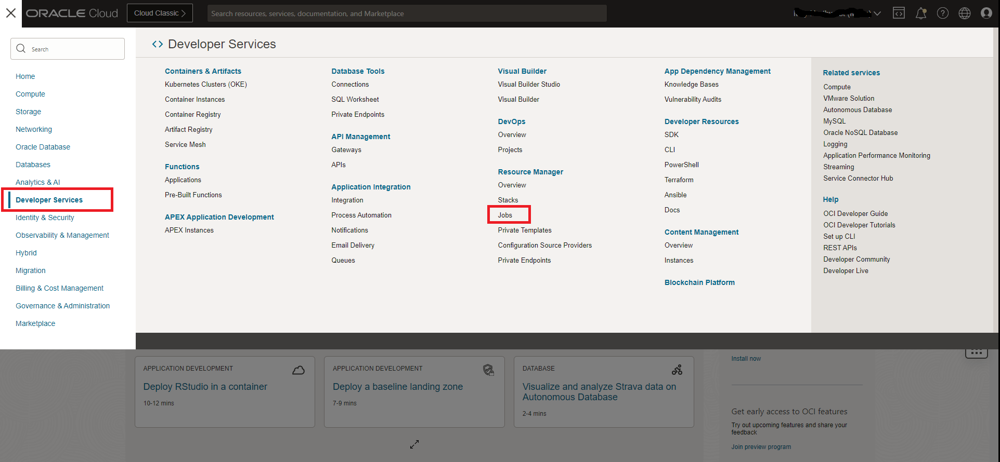
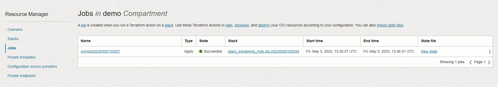
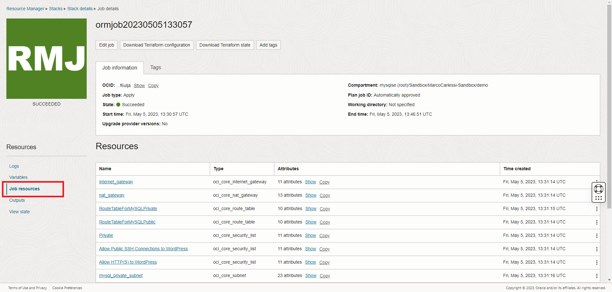
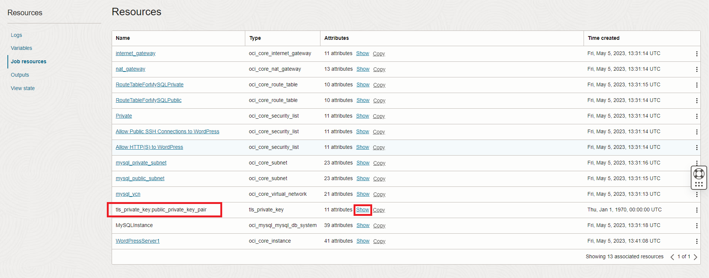
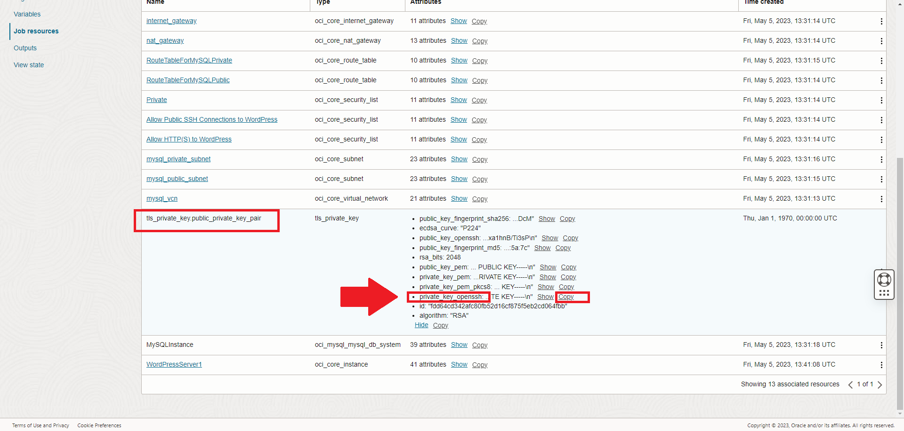
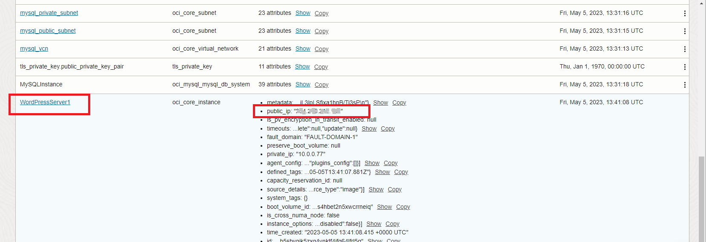
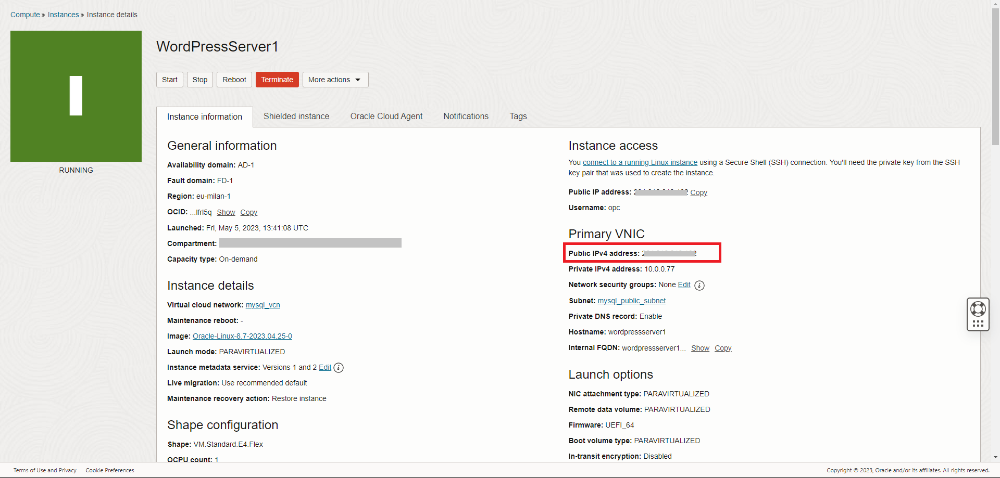

# oci-wordpress-mds

## Introduction
When your "Stack Job" is finished, it's change from "IN PROGRESS" (orange) state to "SUCCEEDED" state (green).
Now you can continue with next part.
We now see how to connect and test our wordpress website. 

In this lab we 
- retrieve the SSH to connect to our wordpress server
- retrieve public IP
- connect to our website
- login ad admin users

## Test Wordpress Installation

 ###Task 1 - Check job execution and retrieve private SSH key to access Wordpress server### 

1. If you are logged out from OCI, re-login with your account.

2. Verify that the job is finished
    1. Open the burger menu

    

    2. Select "Developer Services", then under "Resource Manager section" select "Jobs".  

    

    3. If your compartment is not selected, select it now

    4. Verify that the column "State" of your job is green/Succeeded, then click your job name to see the details page

    

3. Select "Job resources" from left side menu under "Resources". Here you can read all your resource settings (IP addresses, SSH keys, etc.) 

    

4. Let's retrieve the SSH key that we use later.
    Expand the "tls_private_key.public_private_key_pair" resource with the "Show" link

    

5. Copy in the clipboard your private SSH key with the "copy" button. Because there are many keys, be sure to select **private_key_openssh**

    

6. The private key that you just copied has dirty characters (**\n** for new lines and **"** at the beginning and the end). To easily cleanup, paste the copied text into this page

    [http:://X.X.X.X](http:://X.X.X.X)

    

7. If you are using a client with a proprietary key format (e.g. PuTTY), ***we leave to you the conversion of the key accordingly to your tool*** (e.g. PuTTYgen for PuTTY)

Task 2 - Connect to Restaurant home page 

1. Expand last line "WordPressServer1" to show the public IP.
    Write down it, because we need to connect to our Restaurant web page

    

2. If you click on the "WordPressServer1" name, you are automatically redirected to the compute instance and see the related configurations

    

3. Open in a new tab your Restaurant web page using the public IP address just retrieved. Pay attention that to simplify the lab we are not using https (but we strongly recommend to use it in a real environmnet).
    to connect use the format 
    
    **http**://**public_ip**

    [My Restaurant home page](./images/./My_Restaurant-home_page.png)

4. Explore your Restaurant web site

