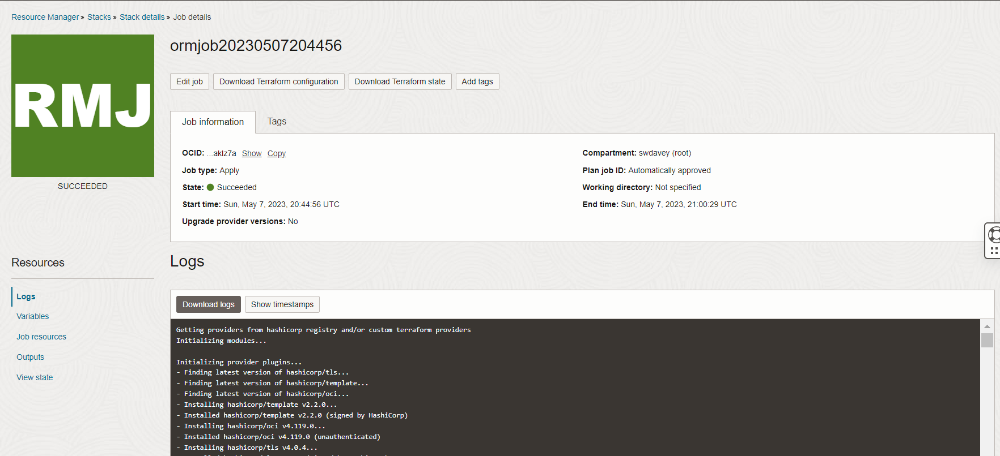
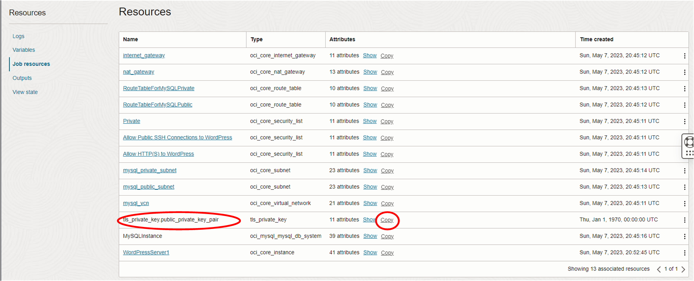
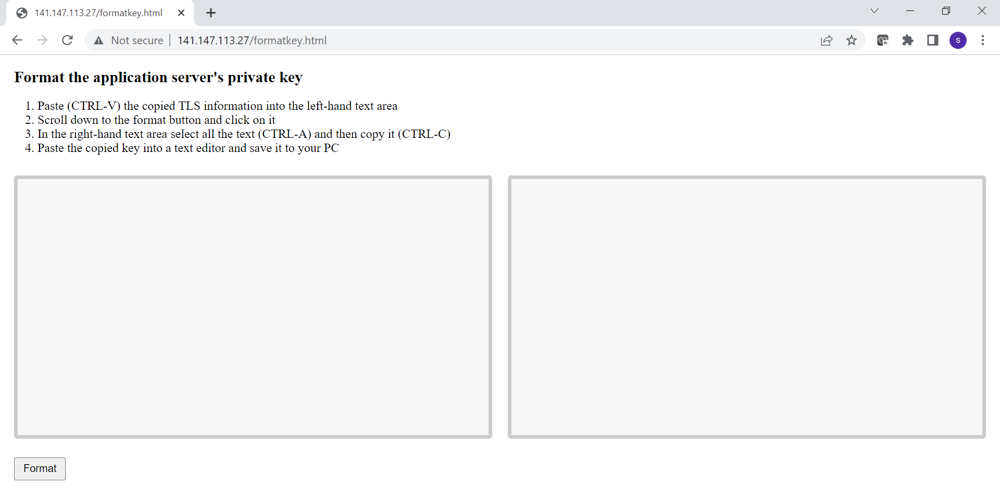
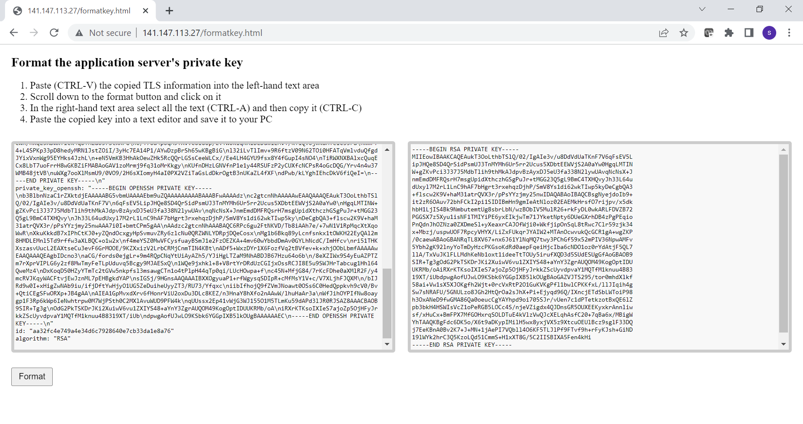
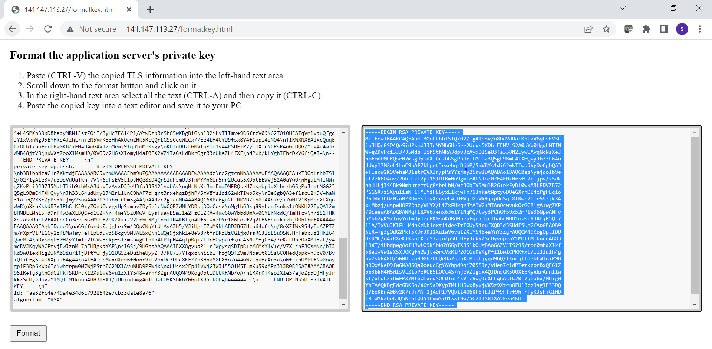
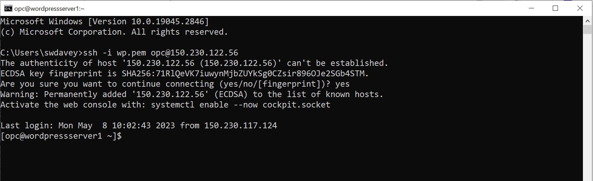
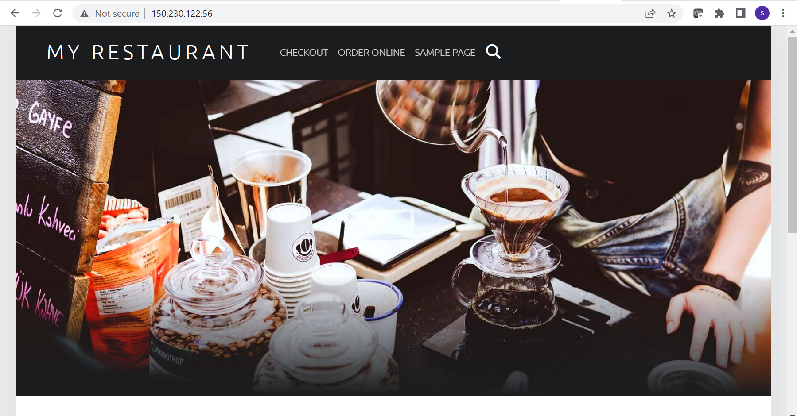
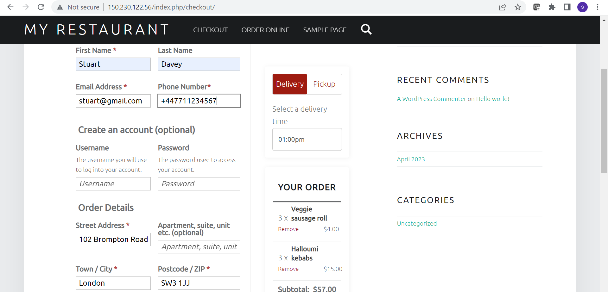
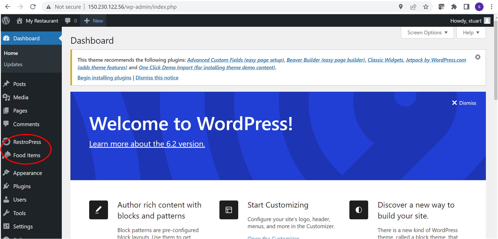
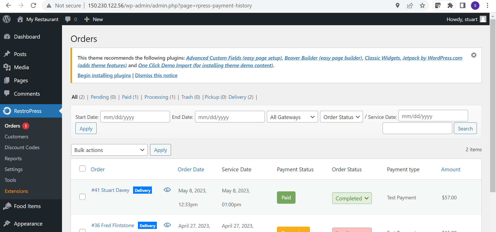

# oci-wordpress-mds

## Introduction
In this lab you will test and get to know your Wordpress installation. This lab can only be started once the 
## Test Wordpress Installation
### Confirm the ORM job (which builds the infrastructure and site) has run successfully
This job typically takes 15-20 minutes so please be patient. When the job completes the RMJ icon in the top left of the ORM page will turn from amber (updating) to green and will state that the job has succeeded (see below). If it turns red then there is an issue. Scroll to the bottom of the log and use its information to diagnose the issue.

### Obtaining information about the installation
Information such as the public IP address of the Wordpress application server can be obtained by accessing the links under the Resources menu (which can be found on left hand side of the ORM RMJ page (see above).

Click on the **Outputs** menu item. Here you will see values for: the database's private IP addrees; the Wordpress database user's name; the Wordpress database user's password, and the public IP address of the Wordpress application server. Note that unless you changed the passwords as part of the installation, then all other passwords will have the same value as the Wordpress user's password. This is not best practice in production and has only been done here to keep things simple for the lab.

Click on the **Job resources** menu item. Here you will see in detail all the resources that went into the making of the infrastructure and Wordpress site.

### Log into your Wordpress application server
In order to complete the rest of the lab you will need to log into the application server. This requires you to know the public IP address of the server and user credentials. The user credentials are formed of a username and a private key. To get this information perform the following steps:

1. The user name is **opc**. This user is part of the sudoers group on the application server meaning it can elevate its privileges to that of root by using the sudo command.
2. The public IP address can be obtained by clicking on the **Outputs** menu item of the ORM RMJ page. Navigate to Outputs and make a note of the Wordpress Public IP address.
3. Getting the private key is a little more difficult. The private key can be found by clicking on the **Job resources** menu item and navigating to the tls_private_key.public_private_key_pair row and then selecting the correct attribute, private_key_pem. However, even then the key will be unusable without some editing. Therefore, to make this process easier we have provided a simple tool that will help you select the correct attribute and make the necessary edits. Follow this procedure:

    1. Navigate to **Job resources**
    2. Scroll down to **tls_private_key.public_private_key_pair** row and click on **copy** (note: if your page is displaying the attributes for this resource, then first click on hide otherwise you won't be able to perform the copy)
    
    3. Open up a browser and enter: http://**public-ip-address**/formatkey.html. The screen shot below for details this. Note that because the URL is using http the browser states that the connection is insecure (i.e. the page was transmitted in the clear). However, the script within the webpage that will convert the key runs entirely within your browser and makes no calls across the internet, etc., Therefore, no information will leave your browser or PC and so the process of converting your key is secure.
    
    
    4. Click in the left hand text area and then paste the copied resources into it. Now click the Format button. This will create a properly formatted pem key and will display it in the right-hand text area. An example is shown below.

    
    
    5. Now copy the formatted key. It is critically important to copy all of the key: from the very first hyphen (-) to the last. An easy way to select this block of text is to click in the right hand pane and then press ctrl-a on the keyboard. Once the text is selected, press ctrl-c to copy. Alternatively use your mouse to select all the text and then its right button to copy. The image below shows the text you must select.
    
    

    6. You now need to save the copied pem into a file. Open an edited such as Notepad and paste the copied pem into it. Give the file a name (e.g. wp.pem) and save it to your PC. 
        - If you are a **Windows user** then it does not matter too much where you save it, a suggestion would be, c:\users\your-name, e.g. c:\users\stuart\wp.pem. If you use PuTTy as an ssh client you will need to convert the pem key into PuTTy's ppk format - use PuTTyGen to do this. 
        - If you are a **linux user** then you should save the file to your user account's .ssh directory and then change its permission to 644, e.g. if your home account is /home/stuart then save the file to /home/stuart/.ssh/wp.pem then chmod 644 /home/stuart/.ssh/wp.pem.
    
    7. You should now be able to log into your application server, using ssh -i path-to-private-key opc@public-ip. An example is shown below (where the public IP address of the application server is 150.230.122.56). Be aware that the first time you log in you will be requested to confirm the authenticity of the host, to which you must answer **yes**. 
    
    There will be a number of scripts and files in the opc home directory. These files are leftovers from the build. Please feel free to look at them, but please **do not attempt to run any of them** as they will most likely destroy what has been built.
    
### A quick tour of your Wordpress restaurant site
As a customer you can reach the restaurant site by entering http://public-ip-address. The image below shows the home page:

If you scroll down the page you will see a (very unintersting) post. If you scroll up you can create an order by clicking on the **Order Online** link. Create an order for delivery that contains a few items, and then go to the checkout. Checkout as a guest - see below for a typical entry. Scroll down the screen and set the Payment Method to be Test Payment. Click on the Place Order button.

Once you have placed the order you should see an Order Confirmation screen. This is what the customer sees. As the owner/adminstrator of the site you will have to process the order. To do this you need to log in as the Wordpress administrator. You can achieve this by entering http://public-ip-address/wp-admin and then entering the requested credentials. For example:

Once you have logged in you will arrive at the admin dashboard. 

Click on RestroPress and change the order status to Completed for the order you made as a customer.

If you have time click on Food Items and explore its options.

