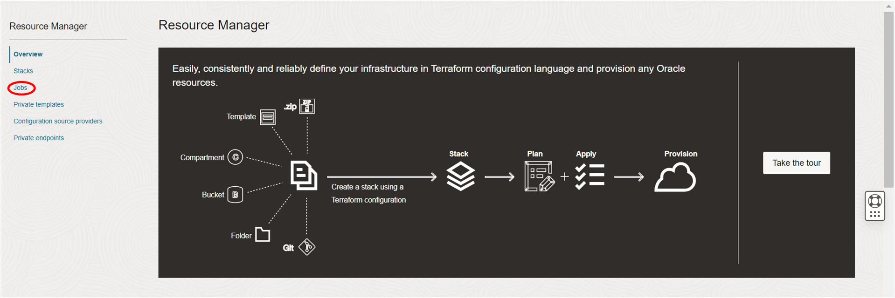
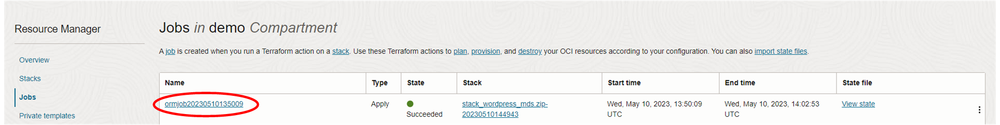

# oci-wordpress-mds

## Introduction

In order to save your credits you may wish to destroy all that has been built. The following describes how to do this using the Resource Manager and the stack definition you imported at the very beginning of this environment. As with all destroy operations, proceed with caution and always think twice before executing.

## Tear-down your Wordpress site

<h3>Task 1 - Destroy your Wordpress site</h3>

1. In the OCI console navigate to the Resource Manager. From the Hamburger menu, select Developer Services and then click on the Resource Manager item.
  
  

2. In the Resource Manager page under the "Resource Manager" menu, click on "Jobs". If you are in the correct compartment then you should see an apply job at the top of the list. If you are not in the correct comparment, change to the correct compartment using the Compartment drop down list (on the left-hand-side of the page). Click on the apply job link.
  
  

3. In the top left of the page, click on Stack Details. This will take you to the Stack that built the initial infrastructure.
  
  

4. Click on the Destroy button.
  
  

5. This will bring up a confirmation dialog, click on its Destroy button.
  
  

It will take 5-10 minutes to destroy the stack so please be patient. 

<h3>Task 2 - Destroy the stack</h3>

The stack will still exist within your tenancy. You can apply this stack and recreate the install. You can also edit it and create a new stack which can then also be installed. However, if you want to completely clear down the stack then follow these instructions. Note: if a stack is deleted before its implementation is destroyed (task 1) then in order to remove its implementation each item of infrastructure will need to be removed manually and with respect to its dependencies.

To destroy the stack follow these steps:

1. From the current Destroy Job page (from Task 1) click on the "Stack Details" link in the top left of the page.

2. In the "Stack Details" click on the "More Actions" menu button and then select "Delete stack".

3. In the confirmation dialog click on Delete. The stack will be deleted.

