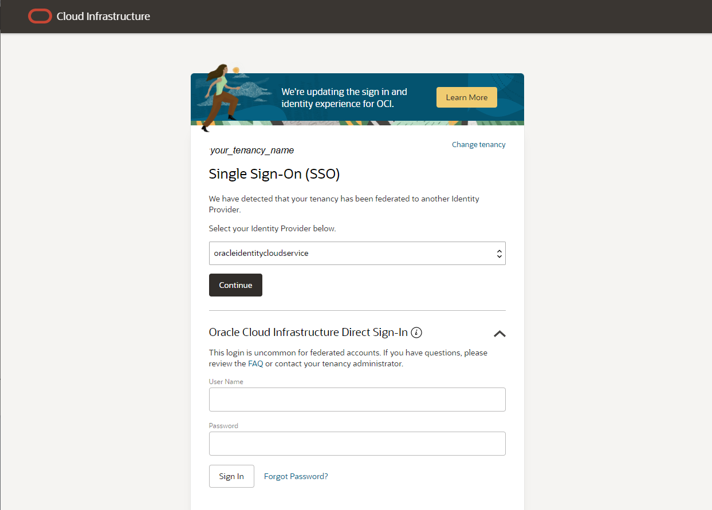
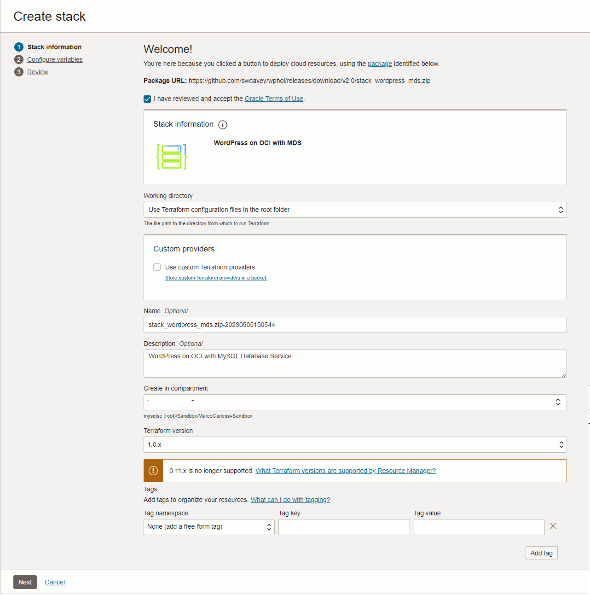
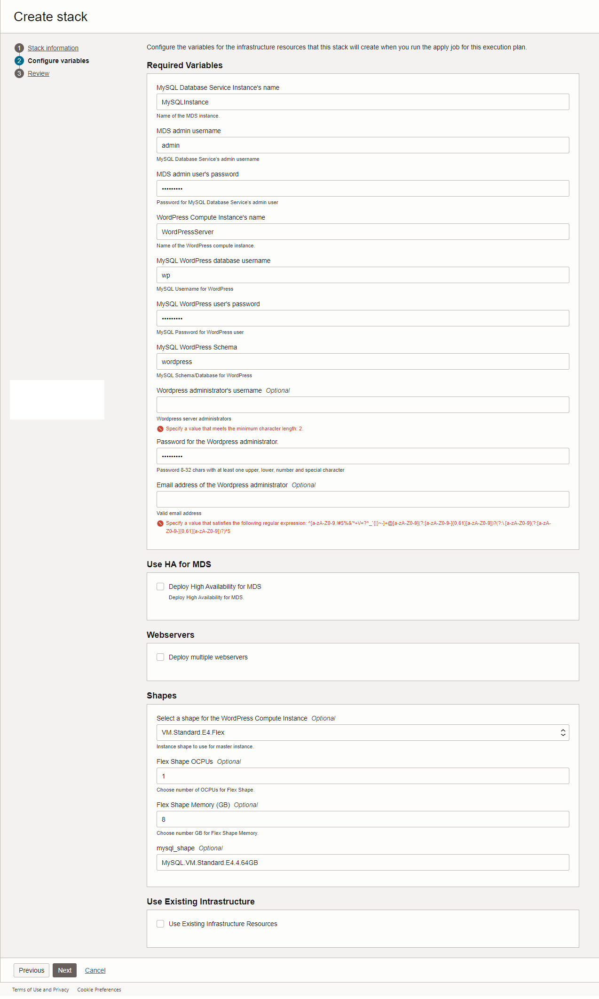

# oci-wordpress-mds

**[Workshop summary](./workshop_instructions.md)**

## Introduction
This workshop focusses on how to effectively use the MySQL HeatWave Database Service with Wordpress.
You will start by creating a simple development environment that will be built using the OCI Resource Manager and the terraform scripts deployed in this GitHub repository.
This lab takes 15-20 minutes to complete.

## Lab preparation
Deploy Wordpress on Oracle Cloud Intrastructure (OCI) and MySQL Database Service (MDS) using Terraform modules.

1. If you haven't already clicked on the Deploy to Oracle Cloud button the please click on it now.

2. You will automatically be directed to your OCI login page.
Enter your tenancy name and click next

Choose **"Oracle Cloud Infrastructure Direct Sign-In"** and insert your username and password

3. Upon log-in you will automatically be directed to an OCI Resource Manager **Create Stack** page. This has been pre-populated with fields that will prompt you for the information necessary to build the basic infrastructure and Wordpress site for this hands-on-lab. You will need to enter the following information:
 
    1. Check the **"I have reviewed and accept the Oracle Terms of Use"** checkbox. By checking this box a zip file will be loaded that contains the scripts which will build the infrastructure and Wordpress site.
    2. Optionally, assign a name to your stack and insert a description.
    3. Choose the compartment where to create the lab resources.
    4. Click next.
    
    

4. On the second page you will have further fields to complete. Please read all these notes before completing this page.

   Notes:

    1. All the mandatory fields must have entries. For convenience all the password fields are preset to the same password. If you leave them as they are then you will be told the password once the build completes. If you change any of the passwords or indeed any of the other preset fields then you **must** make a note of the change because if you forget any of them then you may have to restart the lab.
    2. For the purposes of the hands-on-lab **do not** check any of the boxes in the Use HA for MDS and Webservers sections. If you do then the build will take too long to complete for the hands-on-lab. You may wish to do a further build after the lab in order to test these items.
    3. **Do not** check the Use Existing Infrastructure box.
    4. Assuming you follow the advice above, then all you should need to do is: 
   
   Actions (based on the notes above):
   
      1. Enter the **Wordpress administrator's username**: insert **admin** (or another name, e.g. fred, but make sure you write it down)
      2. Enter the **Email address of the Wordpress administrator**: insert your email address (e.g. fred@bedrock.com)
      3. Click on the Next button
    
    

5. On the third page verify that the checkbox **"Run apply"** is selected and then press **Create**
    

6. The job will start and after few seconds you can see the logs.
    It will take 15-20 minutes to complete.

**[Next lab](./wordpress_test_installation.md)**
