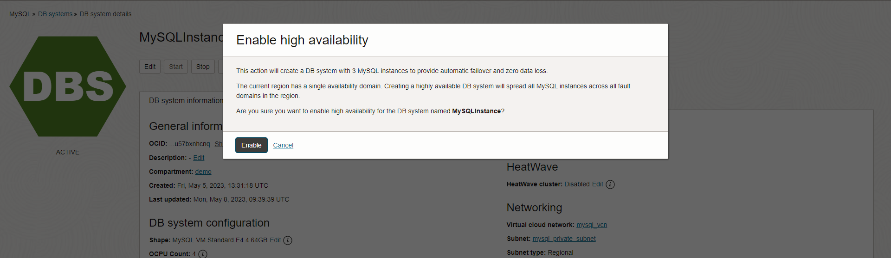

# oci-wordpress-mds

**[Previous lab](./wordpress_test_installation.md)**

## Improve Business Continuity: enable MySQL HeatWave Database Instance High Availability

## Introduction
When systems go into production there are usually requirements for uptime (e.g. 99.99% means less than 1 hour of downtime per year) and to automatically recover from node crashes (e.g. automatic failover). In this lab you learn how to configure the MySQL Database Service in order to meet such requirements.
 

<h3>Task 1 - Enable High Availability</h3>

1. Go to the OCI Dashboard

2. Navigate to the MySQL HeatWave database instances page. Make sure you are in the correct compartment for your database instance.

    

3. In the row that displays your database instance you will see that HA is not enabled.

    

4. To enable HA, click on your database instance's name and then in its details page (below) click on the "More Actions" button menu and select the "Enable High Availability" option.

    

5. Confirm the activation by clicking on "Enable"

    

6. By default, standalone and High Availability instances have different configuration settings. Choose the configuration "MySQL.VM.Standard.E4.4.64GB.HA" and press "Enable"

    

7. Click on enable again. Please note that HA may take 10-15 minutes to complete so please be patient.

    

8. While the change is happening you are not permitted to make other changes to the database. However, you can view its details, look at the work request, etc.
    This is what you should be seeing on the database details page while it is updating to become a HA database.

    

<h3>Task 2 - Test High Availability</h3>

1. When enabling or disabling high availability, the IP address does not change. You can confirm this by viewing the Endpoint section in the database details page: the IP address that was originally assigned to the database instance is now assigned to a VIP that "sits" in front of the three database nodes which form the HA cluster.

2. Now simulate a failure using the "switchover" option.
    From the database details page, open the "More actions" menu and select "Switchover"

    

3. The dialog will prompt you to decide upon the node that you want to failover to. Choose a node other than the primary. Note that it will also display whether your nodes are clustered over Fault Domains (FD) or Availability Domains (AD). ADs are used in larger regions (e.g. Frankfurt, London) and FDs are used in smaller regions (which only have one availability domain).
    
    

4. Even if the instance is in "UPDATE" (orange) status, it's still online. The downtime is limited to the seconds required to complete the switchover. Wait that the instance return to "ACTIVE" (green) status. The status change requires few minutes.

5. Return to your "My Restaurant" web site and navigate its pages, create a food order, etc. You will see that the web site is still working perfectly

**[Next lab](./mds_read_replicas.md)**
