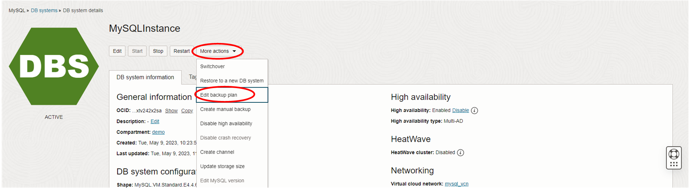
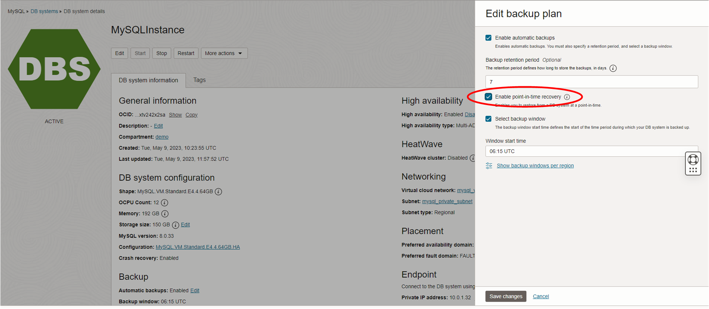

# oci-wordpress-mds

**[Previous lab](./mds_read_replicas.md)**

## Improve the Business Continuity: enable point in time recovery

## Introduction
We have now a highly available and read-scalable Wordpress website.  
It's now time to improve our backup by enabling PITR: we want to preserve our transactions!

<h3>Task 1 - Enable PITR</h3>

  
1. In the OCI console navigate to your database instance as before (i.e. from the Hamburger menu, select Databases, then under MySQL select DB Systems. If you cannot see your database then check that you are in the correct compartment).

  

  
2. Click on your database instance's name in order to get to its details page.
  
3. Click on the "More Actions" menu button, and from the drop down list select Edit backup plan.
  
  

  
4. In the dialog check the box whose label is "Enable point-in-ime recovery". Click on the "Save Changes" button.
  
  

  
5. The process to enable PITR will take a few minutes so please be patient.

### This ends our workshop.
Please remember that tenancy costs are calculated on running instances and space used.
Shutdown the instances when you don't need them or use the stack to easily destroy what we did in this workshop. 
