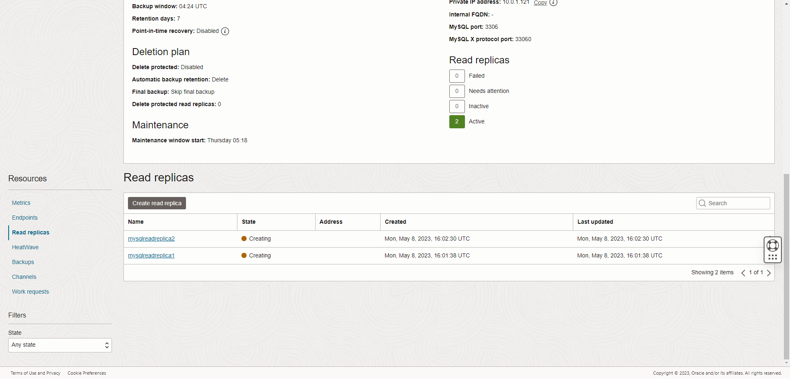

# oci-wordpress-mds

**[Previous lab](./mds_enable_ha.md)**

## Scale your service with Read Replicas

## Introduction
Business is booming. We are open 24 hours a day and suffering no downtime. Hurrah! However, with our extensive menus and blog pages detailing how people can recreate our food at home the database is becomming stressed and causing our website to slow down. To overcome this we have decided to scale out the database with load-balanced read-replica instances. By doing this we will take most of the read load away from the primary database so ensuring our orders are processed properly. 

To implement read replicas and make use of them we not only have to enable them in OCI but we also have to make sure Wordpress both knows about them and can make use of them. Therefore in this lab you will implement read-replicas in OCI and then perform some Wordpress admin, specifically installing and configuring Wordpress plugins that will enable the site to use the installed read-replicas. 

<details>
<summary><h3>Task 1 - Create the Read-Replicas</h3></summary>

1. Connect to OCI Dashboard

2. Navigate to MySQL HeatWave database instances page 

    

3. Click on your HA instance's name to see the details.

    

3. Scroll down the page until you see the menu on the left-hand-side, then select "Read Replicas" and click on "Create read replica"

    

4. Change the "Name" to "mysqlreadreplica1" and press "Create read replica"

    

5. Without waiting for the first replica to complete, click on "Create replica" again in order to create a second replica. This time call the replica "mysqlreadreplica2" and then confirm.

    

6. Replica creation takes some time, so please don't wait and continue with next task

    

</details>


<details>
<summary><h3>Task 2 - Install and configure ludicrousdb wordpress plugin</h3></summary>

1. Connect with ssh to your wordpress server, as you did in lab 1

2. Execute these commands to install the ludicrousdb plugin

    ``` shell
    cd /var/www/html/wp-content/plugins
    sudo wget https://github.com/stuttter/ludicrousdb/archive/refs/heads/master.zip
    sudo unzip master.zip
    sudo mv ludicrousdb-master ludicrousdb
    sudo rm master.zip
    sudo chown -R apache. ludicrousdb
    sudo cp ludicrousdb/ludicrousdb/drop-ins/db.php ../db.php
    sudo cp ludicrousdb/ludicrousdb/drop-ins/db-config.php ../../

    ```

4. Retrieve the MySQL load balancer Endpoint for read replicas.  
    Return to OCI Dashboard and go to MySQL HeatWave database instances

    

5. Click on your HA instance's name "MySQLInstance" to see the details.

    
6. Scroll down the page, and in the menu on the left of the page choose "Endpoints".   
    Here you will see the IP address of your instance for read write access **DB system primary** and for the read replicas load balancer **Read replica load balancer**. Write down these two IP addresses because they will be needed in the next steps

    

7. We must now configure LudicrousDB to use the Read Replica Load Balancer. With an editor (like vim or nano) edit the db-config.php configuration file:

    ``` shell
    cd /var/www/html/
    sudo vim db-config.php 

    ```

8. Scroll down the file to the database configuration section **$wpdb->add_database( array(** see the example below

    

9. Edit the lines shown below using the IP addresses retrieved in the earlier step  

    

10. Save your changes and return to the Restaurant web page. Check that the web site is still working and there are no issues with the new plugin

</details>

<details>
<summary><h3>Task 3 - Create a Snippet</h3></summary>

In order to test our read-replicas we need to create a snippet
    
1. Login to Wordpress as the Wordpress admin (http://***public-ip-address***/wp-admin) and enter the requested credentials

    

2. In the wordpress management page choose "Plugins" from the left-hand-side menu, then click the button "Add New"

    

3. In the text box next to to the "Keyword" drop down (top right side of the page) enter "snippets" and within a second or two the main page will populate with plugin choices (see below).

    

4. Select the "WPCode" plugin and click on "Install Now"

    

5. From left-hand-side menu choose Installed plugins, then press "Activate" for the "WPCode Lite" plugin

    

6. A new menu option called "Code Snippets" will now be visible in the left side menu (you may have to scroll down to see it).  
    Click on "Code Snippets"

    

7. Click on "+ Add Snippet" in the left-hand menu and then hover your mouse over "Add Your Custom Code (New Snippet)" option. This will cause a new button, "Use snippet" to be displayed. Click on it.

    

8. In the Edit Snippet page (see image below):
    1. Enter the title of your snippet, use: "read replicas check"
    2. Select "Code Type": PHP
    3. insert this code in "Code Preview"
        ``` php
        <?php
        global $wpdb;
        $result = $wpdb->get_results("select @@hostname as host");
        echo "<strong>host:</strong> " . $result[0]->host;
        ?>
        ```
    4. Scroll down to "insertion" and click "Run Everywhere" in "Location" to expand the section
    5. Select "Page-Specific"
    6. Click on "Insert Before Paragraph"

    

9. Scroll down to the Insertion section. Keep the defaults as they are: location should read "Insert before paragraph" and paragraph number should be "1" 
    1. Click Inactive switch to activate (the name won't change but the background of the switch should turn blue)
    2. Click on the button in the top left of the screen next to the "Inactive" switch. If this is your first pass it will have a "Save" label, if this a subsequent pass (due to an ealier mistake) it will have an "Update" label.

    

</details>

<details>
<summary><h3>Task 4 - Test read replicas</h3></summary>

1. We can now test our read replicas.  
    In the browser click on "My Restaurant" to return to the web site content

    

2. Select "Sample page".  
    You will see a new line under the title and before the main body of text you will see a label that says "host:" with an alphnumeric value. This value is the database host id - it will belong to either the primary or one of the read-replicas.
 
    Refresh the page multiple times to see that the host changes periodically. By changing we can see that the requests are being load-balanced across the primary and its replicas.

    

</details>

**[Next lab](./mds_enable_pitr.md)**
